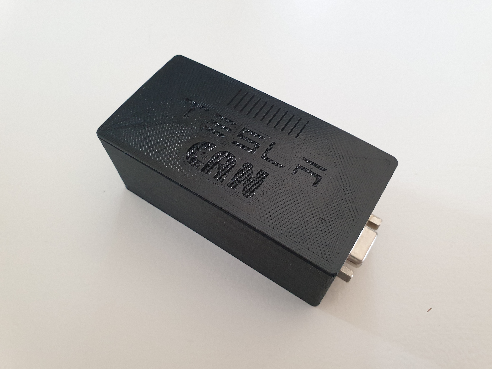
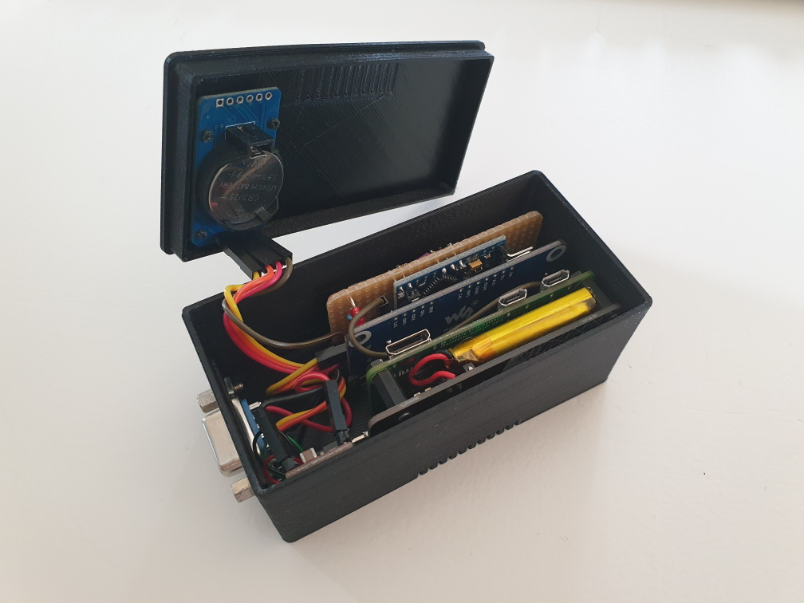
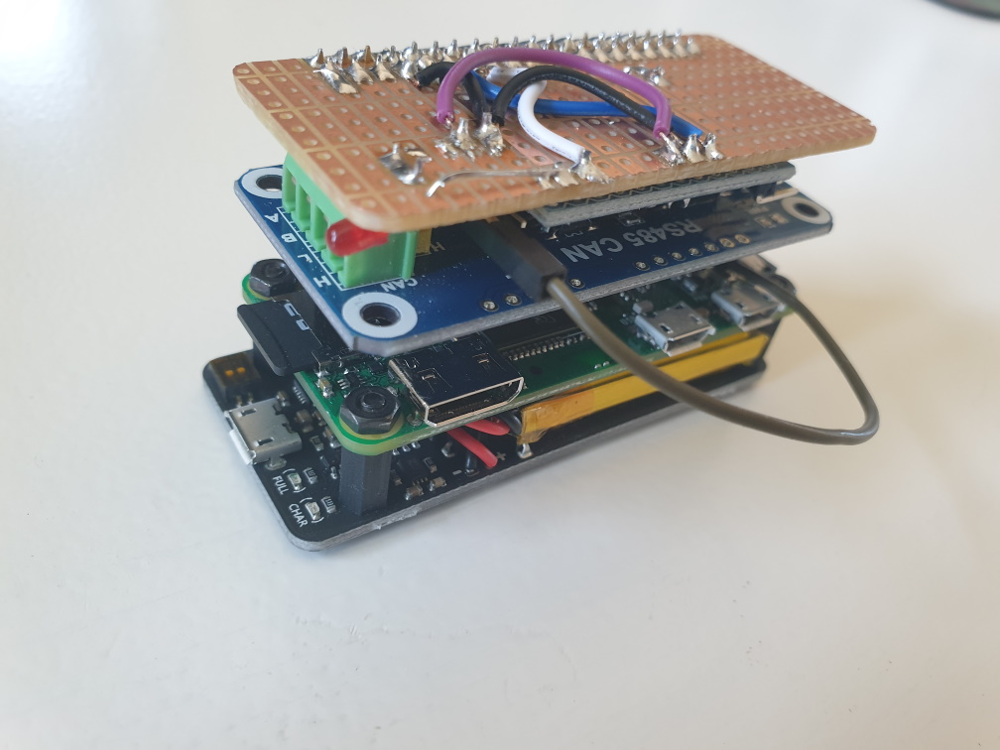
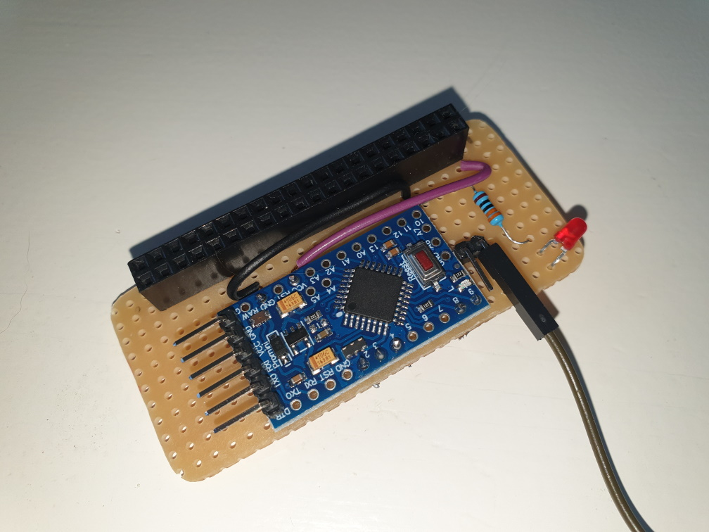

# TeslaCAN
Raspberry Pi Zero as CAN Logger for Tesla Model 3

The hardware consists of

- Raspberry Pi Zero
- Waveshare Pi Zero RS485 CAN HAT (https://www.waveshare.com/wiki/RS485_CAN_HAT)
- Pi Zero UPS Lite (https://github.com/linshuqin329/UPS-Lite)
- DS3231 RTC Shield
- Arduino Pro Mini ATMega328 3.3V 8MHz
- DC/DC Converter 14V -> 5V

The software consists of

- .net executable for Mono on Raspberry Pi running as a service
- Arduino sketch for ATMega328

