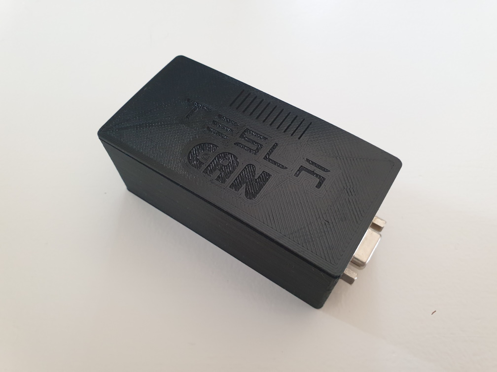

# TeslaCAN
Raspberry Pi Zero as CAN Logger for Tesla Model 3. The CAN data is stored offline on the Pi's SD card and can be pulled by a modifed TeslaLogger (https://github.com/bassmaster187/TeslaLogger). The data is the same (?) as the ScanMyTesla app uses.

The hardware consists of

- Raspberry Pi Zero
- Waveshare Pi Zero RS485 CAN HAT (https://www.waveshare.com/wiki/RS485_CAN_HAT)
- Pi Zero UPS Lite (https://github.com/linshuqin329/UPS-Lite)
- DS3231 RTC Shield
- Arduino Pro Mini ATMega328 3.3V 8MHz
- DC/DC Converter 14V -> 5V

The software consists of

- .net executable for Mono on Raspberry Pi running as a service
- Arduino sketch for ATMega328

## Installation

Connect the Pi with the CAN Hat, UPS, Arduino and RTC like described in the Fritzing file.


### Install Raspbian

Create SD card with Raspbian 10 (buster). Install Mono like described at https://www.mono-project.com/download/stable/#download-lin-debian but using stable-raspbianbuster: 
```
sudo apt install apt-transport-https dirmngr gnupg ca-certificates
sudo apt-key adv --keyserver hkp://keyserver.ubuntu.com:80 --recv-keys 3FA7E0328081BFF6A14DA29AA6A19B38D3D831EF
echo "deb https://download.mono-project.com/repo/debian stable-raspbianbuster main" | sudo tee /etc/apt/sources.list.d/mono-official-stable.list
sudo apt update
```

Prepare startup/shutdown control, CAN HAT and RTC in /boot/config.txt. Pay attention to oscillator, older versions of the CAN HAT may use a different frequency:
```
dtparam=spi=on
dtoverlay=mcp2515-can0,oscillator=12000000,interrupt=25,spimaxfrequency=1000000

dtoverlay=gpio-poweroff,gpiopin=17,active_low="y"
dtoverlay=gpio-shutdown,gpio_pin=27

dtoverlay=i2c-rtc,ds3231
```

### Create Pi Software

Get the free Visual Studio Community Edition (or any other VS) and install the Mono Framework (https://www.mono-project.com/download/stable/). I don't know what's the proper way to tell Visual Studio about the Mono .net library location, I set the "Reference Paths" in TeslaCAN's and dbus-sharps's project properties to the Mono framework directory (e.g. C:\Program Files\Mono\lib\mono\4.6-api). Otherwise Visual Studio will report missing namespace 'Mono'.
Now compile TeslaCAN project. Copy the exe and dll files from the bin directory to /home/pi/TeslaCAN. Install Linux service by copying VisualStudio/Linux Service/TeslaCAN.service to /usr/lib/systemd/system/. Permanently install the service with
```
sudo systemctl enable TeslaCAN
```

In case you want to debug code on the Pi have a look at VSMonoDebugger. This works almost as nice as debugging on a PC!

### Create Arduino Software

Compile and flash Arduino/raspi_power.ino to the Arduino Pro Mini.

## How It Looks




